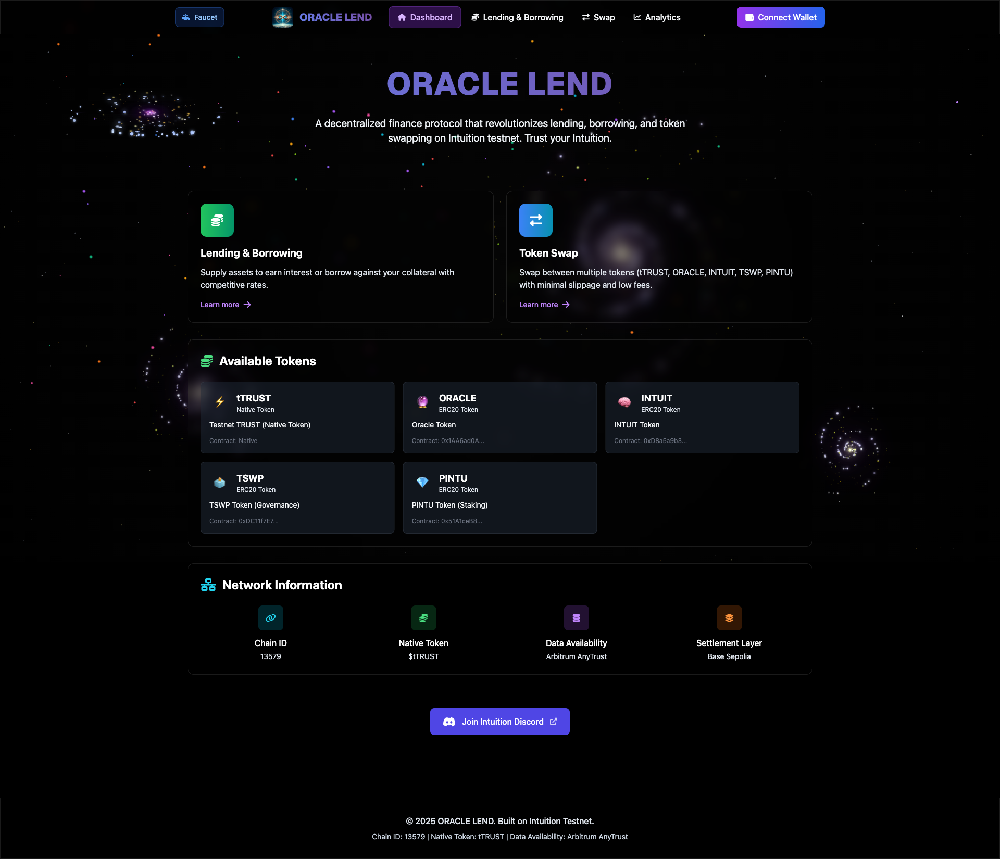
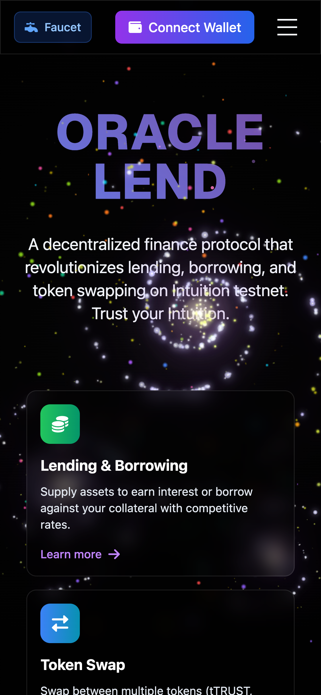
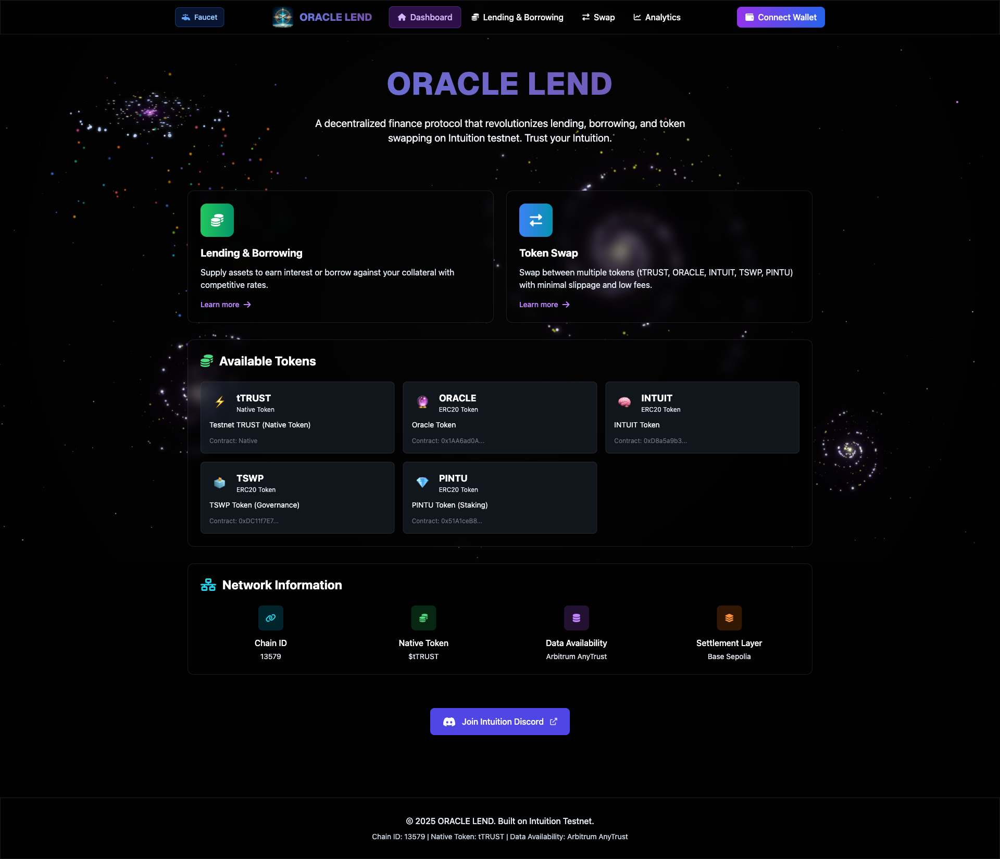
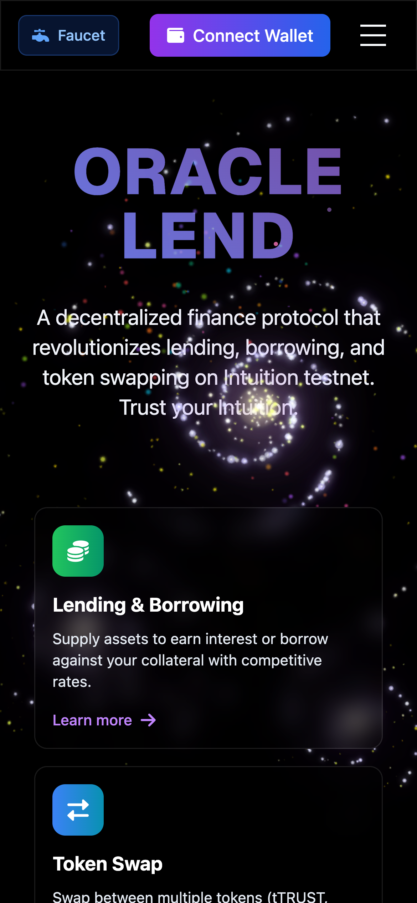
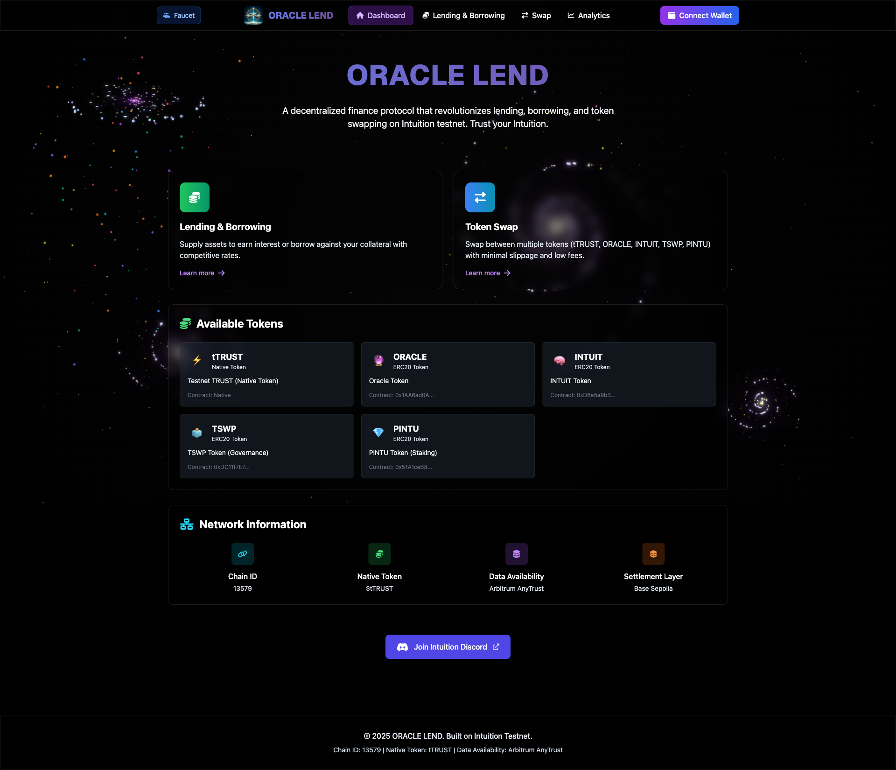
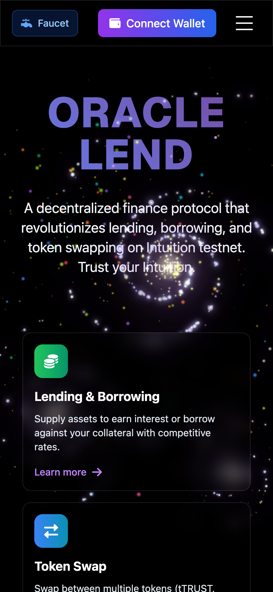

# 👁️Oracle Lend Protocol ✨

<div align="center">

**Advanced DeFi Platform with Lending, Borrowing, and Automated Market Maker**

A sophisticated decentralized finance protocol built on the Intuition blockchain, featuring over-collateralized lending, automated market making, and integrated liquidation systems.

</div>

## Overview

Oracle Lend is a comprehensive DeFi protocol that combines lending/borrowing functionality with an integrated Automated Market Maker (AMM). The platform enables users to supply collateral, borrow against their positions, and trade tokens through the integrated DEX.

## Key Features

- **Over-collateralized Lending**: Supply TTRUST as collateral to borrow ORACLE tokens with 120% collateralization ratio
- **Multi-Token Ecosystem**: 5 tokens deployed on Intuition Testnet with full AMM support
- **Advanced AMM System**: Multiple trading pairs with integrated price oracles
- **Integrated Liquidation System**: 10% liquidation bonus for maintaining protocol health
- **Governance & Staking**: TSWP governance tokens and PINTU staking with 12% APR
- **Real-time Analytics**: Live protocol data, position monitoring, and market statistics
- **Mobile Responsive**: Optimized interface for both desktop and mobile devices

## Screenshots

### Dashboard - Portfolio Overview
<div align="center">
<table>
<tr>
<td align="center"><strong>Desktop</strong></td>
<td align="center"><strong>Mobile</strong></td>
</tr>
<tr>
<td align="center"></td>
<td align="center"></td>
</tr>
</table>
</div>

### Lending & Borrowing Interface
<div align="center">
<table>
<tr>
<td align="center"><strong>Desktop</strong></td>
<td align="center"><strong>Mobile</strong></td>
</tr>
<tr>
<td align="center"></td>
<td align="center"></td>
</tr>
</table>
</div>

### DEX/Swap Interface
<div align="center">
<table>
<tr>
<td align="center"><strong>Desktop</strong></td>
<td align="center"><strong>Mobile</strong></td>
</tr>
<tr>
<td align="center"></td>
<td align="center"></td>
</tr>
</table>
</div>

## 🪙 **Token Ecosystem**

Oracle Lend features a comprehensive 5-token ecosystem deployed on **Intuition Testnet**:

### Core Protocol Tokens

| Token | Symbol | Address | Supply | Purpose |
|-------|--------|---------|--------|---------|
| **⚡ Testnet TRUST** | tTRUST | Native Token | Native | Collateral & Gas |
| **🔮 Oracle Token** | ORACLE | [`0x1AA6...53b04`](https://testnet.explorer.intuition.systems/address/0x1AA6ad0A70Dd90796F2936BD11F0d4DEF7553b04) | 10M | Primary Borrowable Asset |

### Utility & Governance Tokens

| Token | Symbol | Address | Supply | Purpose |
|-------|--------|---------|--------|---------|
| **🧠 INTUIT Token** | INTUIT | [`0xD8a5...cAd43`](https://testnet.explorer.intuition.systems/address/0xD8a5a9b31c3C0232E196d518E89Fd8bF83AcAd43) | 100M | Utility & Predictions |
| **🗳️ TSWP Token** | TSWP | [`0xDC11...2aDD`](https://testnet.explorer.intuition.systems/address/0xDC11f7E700A4c898AE5CAddB1082cFfa76512aDD) | 50M | Governance Voting |
| **💎 PINTU Token** | PINTU | [`0x51A1...6E02`](https://testnet.explorer.intuition.systems/address/0x51A1ceB83B83F1985a81C295d1fF28Afef186E02) | 10M | Staking (12% APR) |

### AMM Trading Pairs

| Trading Pair | DEX Contract | Status |
|--------------|-------------|---------|
| **tTRUST ↔ ORACLE** | [`0x216c...2568`](https://testnet.explorer.intuition.systems/address/0x216cCe003Be533D11Fd4B6d87F066Eef48B42568) | ✅ **Active** (10 TTRUST + 5M ORACLE liquidity) |
| **tTRUST ↔ INTUIT** | [`0x36b5...0AB`](https://testnet.explorer.intuition.systems/address/0x36b58F5C1969B7b6591D752ea6F5486D069010AB) | ✅ **Deployed** |
| **tTRUST ↔ TSWP** | [`0x8198...FbB7`](https://testnet.explorer.intuition.systems/address/0x8198f5d8F8CfFE8f9C413d98a0A55aEB8ab9FbB7) | ✅ **Deployed** |
| **tTRUST ↔ PINTU** | [`0x0355...3f726`](https://testnet.explorer.intuition.systems/address/0x0355B7B8cb128fA5692729Ab3AAa199C1753f726) | ✅ **Deployed** |

> **⚠️ Note**: New DEX pairs require liquidity provision before trading can begin.

## Architecture

Oracle Lend is built on **Scaffold-ETH 2** with a dual-frontend architecture:

### 🎯 **Dual Frontend System**

| Frontend | Port | Purpose | Technology |
|----------|------|---------|------------|
| **Oracle Lend UI** | `:5001` | Production DeFi interface | Vite + React + Custom Design |
| **Scaffold-ETH Debug** | `:3000` | Development & Contract Debug | NextJS + Wagmi + RainbowKit |

### 🏗️ **Technology Stack**

- **Framework**: Scaffold-ETH 2 (SE-2) with Yarn workspaces
- **Smart Contracts**: Hardhat development environment
- **Custom Frontend**: Vite + React + TypeScript with glass-effect design
- **Debug Frontend**: NextJS + Wagmi + RainbowKit (standard SE-2)
- **Blockchain**: Ethers.js integration + Web3 wallet connection
- **Network**: Intuition testnet + Local Hardhat support
- **Styling**: TailwindCSS with mobile-responsive design

## Installation & Setup

### Prerequisites
- Node.js (v20.18.3 or later)
- Yarn package manager (v3.2.3)
- MetaMask wallet extension

### Quick Start

1. **Clone and install dependencies**
```bash
git clone <repository-url>
cd Oracle-Lend
yarn install
```

2. **Start local blockchain** (Terminal 1)
```bash
yarn chain
```

3. **Deploy contracts** (Terminal 2)
```bash
yarn deploy
```

4. **Choose your frontend:**

**🎯 Oracle Lend Production UI** (Terminal 3)
```bash
yarn start
# or
yarn oracle:dev
```
→ Access at `http://localhost:5001`

**🔧 Scaffold-ETH Debug Interface** (Terminal 3)
```bash
yarn debug
# or
yarn next:dev
```
→ Access at `http://localhost:3000`

## Project Structure

```
Oracle-Lend/                    # 🏗️ Scaffold-ETH 2 Root
├── packages/
│   ├── hardhat/               # 🔨 Smart Contracts (Hardhat)
│   │   ├── contracts/         # → OracleLend, DEX, Tokens
│   │   ├── deploy/           # → Deployment scripts
│   │   └── test/             # → Contract tests
│   ├── nextjs/               # 🔧 Debug Frontend (Scaffold-ETH)
│   │   ├── app/              # → NextJS pages
│   │   ├── components/       # → SE-2 standard components
│   │   └── hooks/            # → Wagmi hooks
│   └── replit/               # 🎯 Production Frontend (Oracle Lend)
│       ├── src/components/   # → Oracle Lend UI components
│       ├── src/hooks/        # → Custom Ethers.js hooks
│       └── src/utils/        # → Custom blockchain utilities
├── package.json              # → Yarn workspace scripts
└── README.md                # → This documentation
```

## Smart Contracts

Our protocol consists of several interconnected smart contracts:

- **OracleLend.sol**: Over-collateralized lending with liquidation system (120% ratio)
- **OracleToken.sol**: Advanced ERC20 implementation with minting/burning
- **DEX.sol**: Constant product AMM with integrated price oracle
- **DEXRouter.sol**: Multi-hop trading routing for token pairs
- **Token Contracts**: INTUIT, TSWP, PINTU governance/utility tokens

## Development Workflow

### 🔧 **For Smart Contract Development**
```bash
yarn chain              # Start local Hardhat node
yarn deploy             # Deploy contracts locally
yarn debug              # Open Scaffold-ETH debug interface
```

### 🎯 **For Frontend Development**
```bash
yarn start              # Start Oracle Lend production UI
yarn oracle:dev         # Same as above with explicit name
```

### 🧪 **For Testing**
```bash
yarn test               # Run contract tests
yarn next:build         # Build NextJS debug frontend
yarn oracle:build       # Build production frontend
```

## Network Configuration

### Intuition Testnet (Production) 🌐
- **Chain ID**: `13579`
- **RPC URL**: `https://testnet.rpc.intuition.systems`
- **Currency**: `TTRUST`
- **Block Explorer**: `https://testnet.explorer.intuition.systems`
- **Faucet**: `https://testnet.hub.intuition.systems/`

**✅ All tokens and DEX contracts are deployed and functional on Intuition Testnet**

### Local Development 🔧
- **Chain ID**: `31337`
- **RPC URL**: `http://127.0.0.1:8545`
- **Currency**: `TTRUST`

### MetaMask Configuration
Add Intuition testnet to your wallet:
1. Network Name: `Intuition Testnet`
2. RPC URL: `https://testnet.rpc.intuition.systems`
3. Chain ID: `13579`
4. Currency Symbol: `TTRUST`
5. Block Explorer: `https://testnet.explorer.intuition.systems`

**🎯 Get testnet tokens**: Visit the [Intuition Faucet](https://testnet.hub.intuition.systems/) to receive tTRUST for testing.

## 🚀 **Deployment Status**

### ✅ **Fully Deployed on Intuition Testnet**

**Core Protocol**:
- **OracleLend Contract**: Over-collateralized lending (5M ORACLE funded)
- **Price Oracle**: DEX-based price discovery mechanism
- **Liquidation System**: 10% bonus liquidation mechanism

**Token Ecosystem**:
- **5 ERC20 Tokens**: All deployed with full functionality
- **4 AMM Pairs**: Complete trading infrastructure
- **Real Balances**: Funded contracts with actual token supplies

**Frontend Features**:
- **Multi-Token Support**: All 5 tokens integrated in UI
- **Real-Time Data**: Live blockchain interactions
- **Mobile Responsive**: Optimized for all devices
- **Production Ready**: Glass-effect UI with professional design

### 🎯 **Ready to Use**
1. **Connect** MetaMask to Intuition Testnet
2. **Get** tTRUST from the faucet
3. **Trade** tokens on the integrated DEX
4. **Lend** and **Borrow** with real collateralization
5. **Monitor** positions with live health factors

**Status**: 🟢 **LIVE** - All systems operational on Intuition Testnet

## License

MIT License. See [LICENSE](LICENSE) file for details.

---

**Built with inspiration from Scaffold-ETH 2, enhanced with production-grade DeFi functionality.**

**Disclaimer**: Experimental DeFi software. Use at your own risk.